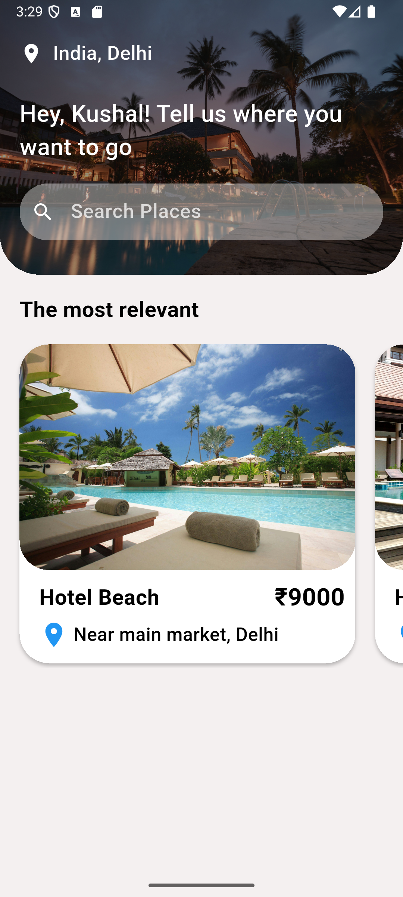

# 🏨 Hotel Booking App

A beautifully designed **Flutter-based hotel booking app** that allows users to explore hotels in different locations, search for travel destinations, and view curated listings—all with a sleek, modern interface.

---

## 📱 Features

- 🌍 **Location-based Discovery**  
  View top destinations and trending hotels with attractive imagery.

- 🔍 **Search Functionality**  
  Users can search for places they want to visit with a responsive search field.

- 🖼️ **Modern UI/UX**  
  Smooth layouts and stylish components, including image cards, search bar, and custom text styling.

- 🏨 **Hotel Listings**  
  Scrollable, interactive horizontal hotel listings with hotel name, price, and location.

---
- **Folder Structure**
- lib/
  ├── main.dart
  ├── services/
  │   └── widget_support.dart
  └── screens/
  └── home.dart
  assets/
  └── images/
  ├── home.jpg
  ├── hotel1.jpg
  └── hotel2.jpg

## 📸 Screenshots

| Home Screen |
|-------------|
|  |

---

## 🚀 Getting Started

### Prerequisites

Ensure you have the following installed:

- Flutter SDK
- Android Studio or VSCode
- Dart SDK

### Installation

```bash
git clone https://github.com/your-username/hotel-booking-app.git
cd hotel-booking-app
flutter pub get
flutter run
