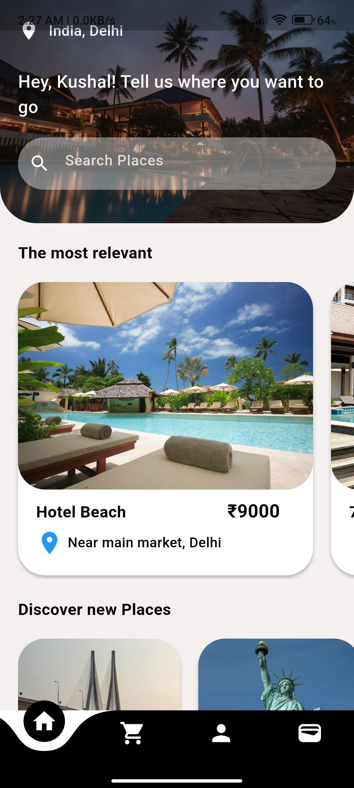
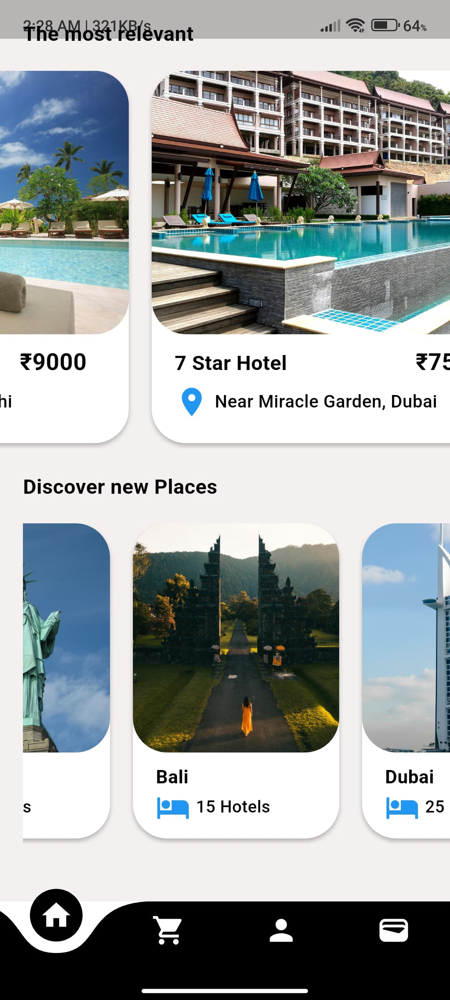
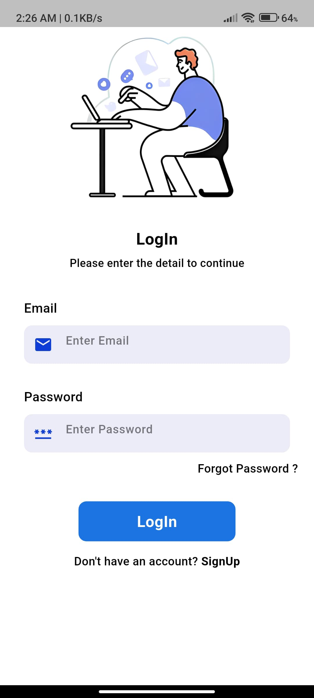
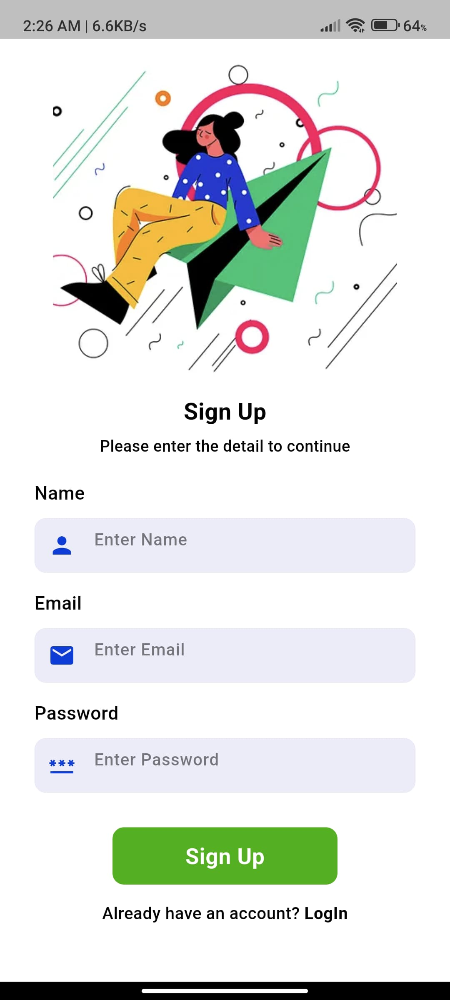

# 🏨 Hotel Booking App

A beautifully crafted **Flutter-based hotel booking app** enabling users to discover, explore, and book hotels across various destinations. It features seamless navigation, user authentication, and a modern, mobile-first UI design.

---

## 📱 Features

- 🔐 **User Authentication**  
  Secure login and signup system for users.

- 🏨 **Hotel Listings & Booking**  
  View and book hotels with pricing, details, and descriptions.

- 👤 **Profile Management**  
  Allows users to update and view their profile information.

- 💼 **Wallet System**  
  Basic wallet screen interface for future payment integration.

- 📱 **Bottom Navigation**  
  Smooth navigation between Home, Profile, Wallet, and Booking screens.

- 🗂️ **Persistent State**  
  Using Shared Preferences to manage login state and simple data.

---

## 📁 Folder Structure

```plaintext
lib/
├── main.dart
├── pages/
│   ├── booking.dart
│   ├── bottomnav.dart
│   ├── detail_page.dart
│   ├── home.dart
│   ├── login.dart
│   ├── profile.dart
│   ├── signup.dart
│   └── wallet.dart
├── services/
│   ├── database.dart
│   ├── shared_pref.dart
│   └── widget_support.dart
assets/
└── images/
    ├── HomeScreen1_Screenshot.png
    ├── HomeScreen2_Screenshot.png
    ├── LogInScreen_Screenshot.png
    └── SignUpScreen_Screenshot.png

```

  

## 📸 Screenshots

<h3>🏠 Home Screens</h3>
<p align="center">
  
  
</p>

<h3>🔐 Authentication Screens</h3>
<p align="center">
  
  
</p>

---

## 🚀 Getting Started

### Prerequisites

Ensure you have the following installed:

- Flutter SDK
- Android Studio or VSCode
- Dart SDK

### Installation

```bash
git clone https://github.com/your-username/hotel-booking-app.git
cd bookingapp
flutter pub get
flutter run
